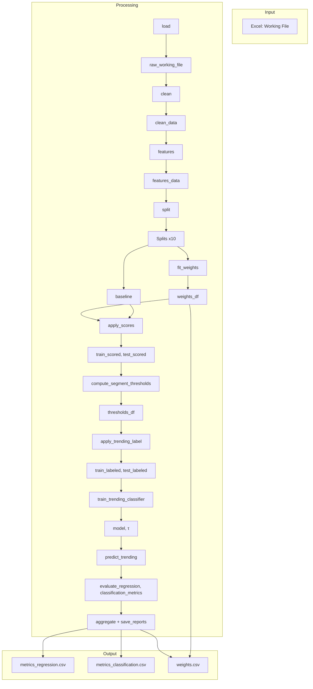

# PopWeight — Evaluation Results & Reference

This file summarizes evaluation metrics, pseudocode, and data flow for the PopWeight
pipeline. Regenerate metrics by running `python main.py report`.

---

## Table of Contents

1. [Evaluation Metrics](#1-evaluation-metrics)
2. [Learned Weights (Sample)](#2-learned-weights-sample)
3. [Pseudocode](#3-pseudocode)
4. [Data Flow Diagram](#4-data-flow-diagram)

---

## 1. Evaluation Metrics

### 1.1 Regression (Score vs log(ER_proxy))

Target: How well does the learned Score predict the true log(ER_proxy)?

| Metric | 0 | 1 | 2 | 3 | 4 | 5 | 6 | 7 | 8 | 9 | **Mean** | Std |
|--------|--------|--------|--------|--------|--------|--------|--------|--------|--------|--------|----------|-----|
| **R²** | 0.270 | 0.276 | 0.256 | 0.272 | 0.274 | 0.269 | 0.265 | 0.270 | 0.268 | 0.266 | **0.269** | 0.006 |
| **MAE** | 0.509 | 0.508 | 0.513 | 0.513 | 0.513 | 0.510 | 0.514 | 0.512 | 0.511 | 0.513 | **0.512** | 0.002 |
| **RMSE** | 0.626 | 0.624 | 0.632 | 0.630 | 0.630 | 0.627 | 0.632 | 0.630 | 0.629 | 0.629 | **0.629** | 0.003 |
| **Pearson** | 0.519 | 0.526 | 0.506 | 0.522 | 0.524 | 0.519 | 0.515 | 0.519 | 0.518 | 0.516 | **0.518** | 0.005 |

**Summary**: R² ≈ 27% (variance explained). MAE/RMSE measure prediction error in log
space. Pearson ≈ 0.52 indicates moderate linear correlation. Low std across seeds
shows stable performance.

---

### 1.2 Classification (Trending)

Target: How well does the classifier predict Trending (top 10% by ER_proxy per
segment)?

| Metric | 0 | 1 | 2 | 3 | 4 | 5 | 6 | 7 | 8 | 9 | **Mean** | Std |
|--------|--------|--------|--------|--------|--------|--------|--------|--------|--------|--------|----------|-----|
| **Accuracy** | 74.2% | 75.4% | 70.7% | 75.0% | 73.0% | 73.5% | 76.3% | 72.7% | 75.5% | 77.7% | **74.4%** | 2.0% |
| **Precision** | 0.209 | 0.205 | 0.198 | 0.218 | 0.201 | 0.200 | 0.214 | 0.207 | 0.215 | 0.208 | **0.208** | 0.007 |
| **Recall** | 0.593 | 0.529 | 0.650 | 0.559 | 0.598 | 0.583 | 0.519 | 0.603 | 0.546 | 0.461 | **0.564** | 0.053 |
| **F1** | 0.309 | 0.296 | 0.303 | 0.313 | 0.301 | 0.298 | 0.303 | 0.309 | 0.309 | 0.287 | **0.303** | 0.008 |

**Summary**: With ~10% positives, accuracy alone is misleading. Precision ≈ 21% (of
predicted Trending, ~1 in 5 is correct). Recall ≈ 56% (of all true Trending, we find
over half). F1 balances both for imbalanced classification.

---

## 2. Learned Weights (Sample)

Seed 0 — one set of (α, β, γ, intercept) per (Platform, Post Type):

| Platform | Post Type | α | β | γ | Intercept | n_train | R²_train |
|----------|-----------|---|----|----|-----------|---------|----------|
| Facebook | Image | 1.81 | 0.88 | 0.31 | -6.62 | 6661 | 0.269 |
| Facebook | Link | 1.91 | 0.85 | 0.28 | -6.68 | 6490 | 0.280 |
| Facebook | Video | 1.95 | 0.83 | 0.31 | -6.78 | 6650 | 0.282 |
| Instagram | Image | 1.90 | 0.89 | 0.24 | -6.68 | 6554 | 0.284 |
| Instagram | Link | 1.97 | 0.88 | 0.28 | -6.86 | 6618 | 0.284 |
| Instagram | Video | 1.86 | 0.89 | 0.28 | -6.65 | 6611 | 0.257 |
| LinkedIn | Image | 1.82 | 0.84 | 0.31 | -6.53 | 6575 | 0.269 |
| LinkedIn | Link | 1.91 | 0.95 | 0.24 | -6.82 | 6773 | 0.279 |
| LinkedIn | Video | 1.72 | 0.76 | 0.32 | -6.22 | 6658 | 0.272 |
| Twitter | Image | 1.74 | 0.76 | 0.26 | -6.15 | 6689 | 0.251 |
| Twitter | Link | 1.94 | 0.76 | 0.33 | -6.65 | 6666 | 0.270 |
| Twitter | Video | 1.72 | 0.88 | 0.35 | -6.49 | 6666 | 0.269 |

*Score = intercept + α·Likes_ll + β·Comments_ll + γ·Shares_ll*

---

## 3. Pseudocode

### 3.1 Learning Coefficients (weights.py)

```
INPUT:  D_train (cleaned + transformed)
OUTPUT: weights_df (α, β, γ, intercept per segment)

Target:  y_i = log(Eng_i / max(Reach_i, 1))   // log(ER_proxy)
Features: X_i = [Likes_ll_i, Comments_ll_i, Shares_ll_i]

// Global fallback (for small segments)
fit: y = b0 + α_global·Likes_ll + β_global·Comments_ll + γ_global·Shares_ll
     on ALL of D_train

// Per segment
for each segment k = (Platform, Post Type):
    Dk = rows in D_train where Segment == k
    if |Dk| < MIN_SEGMENT_SAMPLES (20):
        Wk = (α_global, β_global, γ_global, b0)
        strategy = "global_fallback"
    else:
        fit: y = bk + αk·Likes_ll + βk·Comments_ll + γk·Shares_ll on Dk
        Wk = (αk, βk, γk, bk)
        strategy = "segment"
    store Wk in weights_df
```

---

### 3.2 Score Prediction (scoring.py)

```
INPUT:  df (Likes_ll, Comments_ll, Shares_ll, Platform, Post Type), weights_df
OUTPUT: df with Score column

for each row i:
    k = (Platform_i, Post_Type_i)
    (α, β, γ, b) = Wk from weights_df
    if k not in weights_df:
        (α, β, γ, b) = mean of all segment weights  // fallback
    Score_i = b + α·Likes_ll_i + β·Comments_ll_i + γ·Shares_ll_i
```

---

### 3.3 Trending Labels (trending.py)

```
INPUT:  train_df, test_df
OUTPUT: df with Trending column (0 or 1)

// Compute thresholds (train only)
for each segment k:
    for each row i in Dk_train:
        ER_proxy_i = (Likes_i + Comments_i + Shares_i) / max(Reach_i, 1)
    Tk = quantile(ER_proxy in segment k, TREND_PERCENTILE)  // e.g., 90th

// Apply labels (train + test)
for each row i:
    ER_proxy_i = Eng_i / max(Reach_i, 1)
    k = (Platform_i, Post_Type_i)
    T = Tk if k has threshold else median(all Tk)
    Trending_i = 1 if ER_proxy_i >= T else 0
```

---

### 3.4 Trending Classifier Prediction (models.py)

```
INPUT:  test_df (Score, Eng_log, Platform, Post Type, ...)
OUTPUT: y_pred, y_prob

Features: X = [Score, Eng_log, OneHot(Platform, Post Type, Weekday Type, ...)]

y_prob = model.predict_proba(X)[:, 1]   // probability of Trending
y_pred = 1 if y_prob >= τ* else 0       // τ* = threshold that max F1 on val_sub
```

---

## 4. Data Flow Diagram

### 4.1 Mermaid (for GitHub / rendered Markdown)



---

### 4.2 ASCII Block Diagram

```
┌─────────────────────────────────────────────────────────────────────────────┐
│ INPUT: Excel (Working File)                                                  │
│       Columns: Platform, Post Type, Likes, Comments, Shares, Reach, ...      │
└─────────────────────────────────────────────────────────────────────────────┘
                                    │
                                    ▼
┌─────────────────────────────────────────────────────────────────────────────┐
│ load           → raw_working_file                                            │
│ clean          → clean_data                                                  │
│ features       → features_data (Likes_ll, Comments_ll, Shares_ll, Segment)  │
│ split          → [Split(seed, train_df, test_df)] × 10                       │
└─────────────────────────────────────────────────────────────────────────────┘
                                    │
              ┌─────────────────────┴─────────────────────┐
              ▼                                           ▼
┌──────────────────────────────┐   ┌──────────────────────────────────────────┐
│ fit_weights                  │   │ baseline                                 │
│   → weights_df               │   │   Score_baseline = L_ll + C_ll + S_ll   │
└──────────────────────────────┘   └──────────────────────────────────────────┘
              │                                           │
              └─────────────────────┬─────────────────────┘
                                    ▼
┌─────────────────────────────────────────────────────────────────────────────┐
│ apply_scores             → train_scored, test_scored (Score)                 │
│ compute_segment_thresholds → thresholds_df                                     │
│ apply_trending_label     → train_labeled, test_labeled (Trending)             │
│ train_trending_classifier → (model, τ)                                        │
│ predict_trending         → y_pred, y_prob                                     │
│ evaluate_regression, classification_metrics                                  │
│ aggregate + save_reports                                                      │
└─────────────────────────────────────────────────────────────────────────────┘
                                    │
                                    ▼
┌─────────────────────────────────────────────────────────────────────────────┐
│ OUTPUT: metrics_regression.csv, metrics_classification.csv, weights.csv      │
│         results.sqlite, diagnostics_report.json                              │
└─────────────────────────────────────────────────────────────────────────────┘
```

---

## Source Files

| Output | Path |
|--------|------|
| Regression metrics | `outputs/metrics_regression.csv` |
| Classification metrics | `outputs/metrics_classification.csv` |
| Weights | `outputs/weights.csv` |
| SQLite database | `outputs/results.sqlite` |
| Diagnostics | `outputs/diagnostics_report.json` |

*Run `python main.py report` to regenerate these files.*
